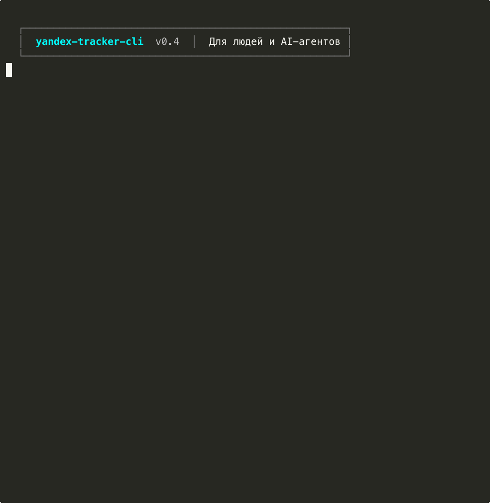

<h1 align="center">tracker</h1>

<p align="center">
  CLI для Яндекс Трекера — для людей и AI-агентов
</p>

<p align="center">
  <a href="https://www.npmjs.com/package/@polza-ai/yandex-tracker-cli"></a>
  <a href="https://github.com/polza-ai/yandex-tracker-cli/blob/main/LICENSE"></a>
  
  
</p>

<p align="center">
  
</p>

---

- **Для людей** — цветные таблицы, спиннеры, интерактивная настройка
- **Для AI-агентов** — `--json` на каждой команде, готовый [SKILL.md](./SKILL.md) с воркфлоу
- **Полный цикл** — 13 команд: от создания задачи до аттачей и учёта времени

## Быстрый старт

```bash
npm i -g @polza-ai/yandex-tracker-cli

tracker init                    # интерактивная настройка
tracker tasks --assignee me     # мои задачи
tracker task PROJ-1             # детали задачи
tracker create -s "Исправить баг" -t bug -p critical
```

## Команды

| Команда | Описание | Пример |
|---------|----------|--------|
| `init` | Настроить подключение | `tracker init` |
| `tasks` | Поиск и список задач | `tracker tasks -a me -s open` |
| `task` | Детали задачи | `tracker task PROJ-123` |
| `create` | Создать задачу | `tracker create -s "Название" -t bug` |
| `status` | Изменить статус | `tracker status PROJ-123 inProgress` |
| `comment` | Комментарии | `tracker comment PROJ-123 "Готово"` |
| `time` | Учёт времени | `tracker time PROJ-123 log 2h30m` |
| `sprint` | Текущий спринт | `tracker sprint --tasks` |
| `checklist` | Чеклист задачи | `tracker checklist PROJ-123 add "Тесты"` |
| `link` | Связи между задачами | `tracker link PROJ-123 PROJ-456 --type blocks` |
| `update` | Обновить поля задачи | `tracker update PROJ-123 -p critical` |
| `transitions` | Доступные переходы | `tracker transitions PROJ-123` |
| `attach` | Аттачи | `tracker attach PROJ-123 report.pdf` |

> Все команды поддерживают `--json` для машинного вывода.

## Интеграция с AI-агентами

`tracker` спроектирован как инструмент для AI-агентов: данные идут в stdout (JSON/таблица), логи и спиннеры — в stderr. Флаг `--json` возвращает стабильный конверт:

```json
{ "ok": true,  "data": { "key": "PROJ-123", "summary": "..." } }
{ "ok": false, "error": { "code": "NOT_FOUND", "message": "Задача не найдена" } }
```

### Подключение

**Claude Code** — положите [SKILL.md](./SKILL.md) в корень проекта. `CLAUDE.md` подхватится автоматически.

**Cursor / Windsurf** — скопируйте SKILL.md:
```bash
cp SKILL.md .cursor/rules/tracker-workflow.md
```

**Любой агент** — используйте `--json` и парсите `{ ok, data }` / `{ ok, error }`.

## Конфигурация

### Глобальный конфиг

`~/.tracker-cli/config.json` — создаётся через `tracker init`:

```json
{
  "token": "y0_AgAAAA...",
  "tokenType": "oauth",
  "orgId": "123456",
  "defaultQueue": "BACKEND",
  "apiBaseUrl": "https://api.tracker.yandex.net/v2"
}
```

### Проектный конфиг

`.tracker.json` — переопределяет настройки для конкретного проекта:

```json
{
  "queue": "BACKEND",
  "boardId": 42,
  "statusMap": {
    "open": "open",
    "inProgress": "inProgress",
    "review": "readyForReview",
    "testing": "testing",
    "closed": "closed"
  }
}
```

`statusMap` маппит каноничные имена статусов на реальные ключи вашего workflow.

Поддерживаются организации **Яндекс 360** (OAuth) и **Yandex Cloud** (IAM-токен, флаг `--iam` при `init`).

<details>
<summary><strong>Полный справочник команд</strong></summary>

### init

```
tracker init [--iam] [--project]
```

| Флаг | Описание |
|------|----------|
| `--iam` | Использовать IAM-токен (Yandex Cloud) |
| `--project` | Создать `.tracker.json` в текущей директории |

### tasks

```
tracker tasks [опции]
```

| Флаг | Описание |
|------|----------|
| `-q, --queue <queue>` | Очередь |
| `-a, --assignee <login>` | Исполнитель (`me` — текущий пользователь) |
| `-s, --status <status>` | Статус |
| `--sprint <sprint>` | Спринт |
| `--query <tql>` | Произвольный TQL-запрос |
| `--all` | Включить закрытые задачи |
| `-l, --limit <n>` | Максимум задач (по умолчанию: 50) |
| `--sort <field>` | Сортировка: `updated`, `created`, `priority` |
| `--json` | JSON-вывод |

### task

```
tracker task <key> [--json]
```

Выводит полную информацию о задаче: название, описание, статус, исполнитель, приоритет, тип, теги, связи, чеклист, комментарии, залогированное время.

### create

```
tracker create -s "Название" [опции]
```

| Флаг | Описание |
|------|----------|
| `-s, --summary <text>` | Название задачи **(обязательно)** |
| `-d, --description <text>` | Описание |
| `-q, --queue <queue>` | Очередь |
| `-t, --type <type>` | Тип: `task`, `bug`, `story`... (по умолчанию: `task`) |
| `-p, --priority <priority>` | `blocker`, `critical`, `major`, `normal`, `minor` |
| `-a, --assignee <login>` | Исполнитель |
| `--parent <key>` | Родительская задача (для подзадач) |
| `--tag <tags...>` | Теги |
| `--json` | JSON-вывод |

### status

```
tracker status <key> <status> [-c "комментарий"] [--json]
```

Статусы: `open`, `inProgress`, `review`, `testing`, `closed` (маппятся через `statusMap` в конфиге).

### comment

```
tracker comment <key> [text] [опции]
```

| Флаг | Описание |
|------|----------|
| `-f, --file <path>` | Текст комментария из файла |
| `-l, --list` | Показать все комментарии |
| `--json` | JSON-вывод |

### time

```
tracker time <key> <action> [duration] [опции]
```

**Действия:** `start`, `stop`, `log <duration>`, `show`

**Формат длительности:** `15m`, `1h`, `2h30m`, `1d` (1 день = 8 часов)

| Флаг | Описание |
|------|----------|
| `-c, --comment <text>` | Комментарий к записи |
| `--json` | JSON-вывод |

### sprint

```
tracker sprint [-b <id>] [--tasks] [--json]
```

| Флаг | Описание |
|------|----------|
| `-b, --board <id>` | ID доски (или `boardId` из `.tracker.json`) |
| `--tasks` | Показать задачи спринта |
| `--json` | JSON-вывод |

### checklist

```
tracker checklist <key> [action] [text] [--json]
```

**Действия:** без аргументов — показать, `add <text>` — добавить, `check <номер>` — отметить.

### link

```
tracker link <key> [target] [-t <type>] [--json]
```

**Типы связей:** `relates` (по умолчанию), `blocks`, `depends`, `duplicates`, `parent`, `subtask`.

Без `target` — показывает существующие связи.

### update

```
tracker update <key> [опции]
```

| Флаг | Описание |
|------|----------|
| `-s, --summary <text>` | Новое название |
| `-d, --description <text>` | Новое описание |
| `-a, --assignee <login>` | Новый исполнитель |
| `-p, --priority <priority>` | Новый приоритет |
| `--tag <tags...>` | Теги |
| `--json` | JSON-вывод |

### transitions

```
tracker transitions <key> [--json]
```

Показывает текущий статус и все доступные переходы.

### attach

```
tracker attach <key> [file] [опции]
```

| Флаг | Описание |
|------|----------|
| `-l, --list` | Список аттачей |
| `--download <id>` | Скачать аттач по ID |
| `-o, --output <path>` | Путь для сохранения |
| `--json` | JSON-вывод |

</details>

<details>
<summary><strong>Разработка</strong></summary>

```bash
git clone https://github.com/polza-ai/yandex-tracker-cli.git
cd yandex-tracker-cli
npm install

npm run dev -- tasks --assignee me   # запуск через tsx
npm run build                        # компиляция в dist/
npm run typecheck                    # проверка типов
npm test                             # тесты (Vitest)
```

</details>

## Требования

- **Node.js** 20+
- **Токен** Яндекс Трекера — OAuth или [IAM](https://yandex.cloud/docs/iam/concepts/authorization/iam-token) (для Yandex Cloud)

## Лицензия

[MIT](./LICENSE)

---

<p align="center">
  Сделано в <a href="https://polza.ai">polza.ai</a> — №1 LLM агрегатор в России
</p>
